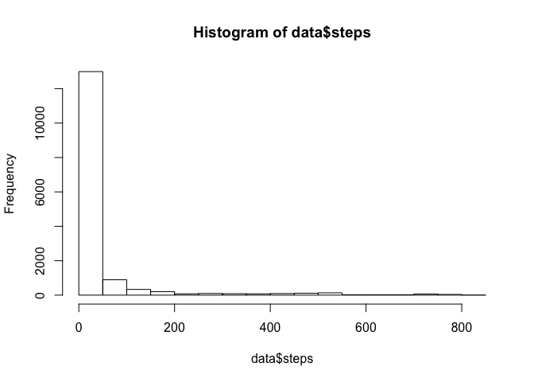
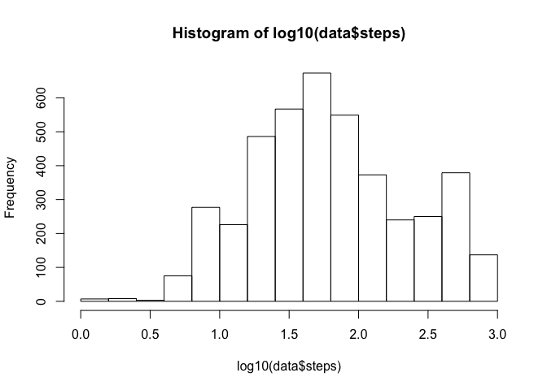
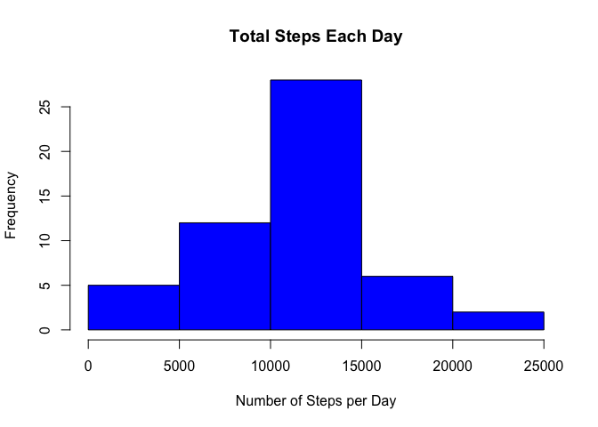
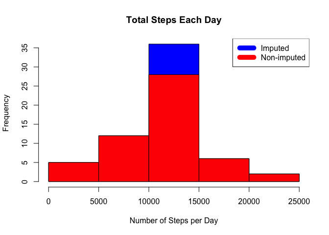

# Reproducible Research Project 1
ATM - A Coursera Student  
March 6, 2016  

### Motivation

The purpose of this project is to demonstrate principles of reproducible research by scripting an analysis of FitBit data. This is the first project of the Reproducible Research module in Coursera's Data Science specialization track. 

Data for this project was downloaded on March 6, 2016, from the course web site (url: https://www.coursera.org/learn/reproducible-research/peer/gYyPt/course-project-1).


### Background on data set - from Coursera project assignment page

It is now possible to collect a large amount of data about personal movement using activity monitoring devices such as a Fitbit, Nike Fuelband, or Jawbone Up. These type of devices are part of the “quantified self” movement – a group of enthusiasts who take measurements about themselves regularly to improve their health, to find patterns in their behavior, or because they are tech geeks. But these data remain under-utilized both because the raw data are hard to obtain and there is a lack of statistical methods and software for processing and interpreting the data.

This assignment makes use of data from a personal activity monitoring device. This device collects data at 5 minute intervals through out the day. The data consists of two months of data from an anonymous individual collected during the months of October and November, 2012 and include the number of steps taken in 5 minute intervals each day.

The variables included in this dataset are:

* steps: Number of steps taking in a 5-minute interval (missing values are coded as 𝙽𝙰)
* date: The date on which the measurement was taken in YYYY-MM-DD format
* interval: Identifier for the 5-minute interval in which measurement was taken

The dataset is stored in a comma-separated-value (CSV) file and there are a total of 17,568 observations in this dataset.


### Part 1 - Loading and preprocessing data - with brief EDA added


```r
filePath <- "/Users/Data Science Coursera/RepData_PeerAssessment1"
setwd(filePath)
data <- read.csv("activity.csv")

dim(data)
```

```
## [1] 17568     3
```

```r
head(data)
```

```
##   steps       date interval
## 1    NA 2012-10-01        0
## 2    NA 2012-10-01        5
## 3    NA 2012-10-01       10
## 4    NA 2012-10-01       15
## 5    NA 2012-10-01       20
## 6    NA 2012-10-01       25
```

```r
str(data)
```

```
## 'data.frame':	17568 obs. of  3 variables:
##  $ steps   : int  NA NA NA NA NA NA NA NA NA NA ...
##  $ date    : Factor w/ 61 levels "2012-10-01","2012-10-02",..: 1 1 1 1 1 1 1 1 1 1 ...
##  $ interval: int  0 5 10 15 20 25 30 35 40 45 ...
```

```r
hist(data$steps)
```

 

```r
hist(log10(data$steps))
```

 

### Part 2 - What is mean total number of steps taken per day?  
For this part of the assignment, you can ignore the missing values in the dataset.

* Calculate the total number of steps taken per day
* Make a histogram of the total number of steps taken each day
* Calculate and report the mean and median of the total number of steps taken per day


```r
steps_by_day <- aggregate(steps ~ date, data, sum)
hist(steps_by_day$steps, main = paste("Total Steps Each Day"), col="blue", xlab="Number of Steps per Day")
```

 

```r
rmean <- format(mean(steps_by_day$steps, na.rm=TRUE),scientific=FALSE)
rmedian <- median(steps_by_day$steps, na.rm=TRUE)
```

The mean number of steps per day is 10766.19 and the median number of steps per day is 10765.


### Part 3 - What is the average daily activity pattern?
* Make a time series plot (i.e. 𝚝𝚢𝚙𝚎 = "𝚕") of the 5-minute interval (x-axis) and the average number of steps taken, averaged across all days (y-axis)
* Which 5-minute interval, on average across all the days in the dataset, contains the maximum number of steps?


```r
steps_by_interval <- aggregate(steps ~ interval, data, mean) 
plot(steps_by_interval$interval,steps_by_interval$steps, type="l", xlab="Interval", ylab="Number of Steps",main="Average Number of Steps per Day by Interval")
```

 

```r
max_interval <- steps_by_interval[which.max(steps_by_interval$steps),1]
steps_max_interval <- round(steps_by_interval[which.max(steps_by_interval$steps),2],0)
```
The interval 835 has the highest average count of steps, with 206 steps.

### Part 4 - Impute missing values

* Calculate and report the total number of missing values in the dataset (i.e. the total number of rows with 𝙽𝙰s)
* Devise a strategy for filling in all of the missing values in the dataset. The strategy does not need to be sophisticated. For example, you could use the mean/median for that day, or the mean for that 5-minute interval, etc.
* Create a new dataset that is equal to the original dataset but with the missing data filled in.
* Make a histogram of the total number of steps taken each day and Calculate and report the mean and median total number of steps taken per day. Do these values differ from the estimates from the first part of the assignment? What is the impact of imputing missing data on the estimates of the total daily number of steps?


```r
# How many missing
missing <- is.na(data$steps)
table(missing)
```

```
## missing
## FALSE  TRUE 
## 15264  2304
```

```r
#Impute interval average steps for missing values
data_imputed <- data
nas <- is.na(data_imputed$steps)
avg_interval <- tapply(data_imputed$steps, data_imputed$interval, mean, na.rm=TRUE, simplify=TRUE)
data_imputed$steps[nas] <- avg_interval[as.character(data_imputed$interval[nas])]

# Audit for zero missing values
missing <- is.na(data_imputed$steps)
table(missing)
```

```
## missing
## FALSE 
## 17568
```

```r
# Regenerate Histogram, mean and median after imputing missing values
steps_by_day_imputed <- aggregate(steps ~ date, data_imputed, sum)
hist(steps_by_day_imputed$steps, main = paste("Total Steps Each Day"), col="blue", xlab="Number of Steps per Day")

#Create Histogram to show difference. 
hist(steps_by_day$steps, main = paste("Total Steps Each Day"), col="red", xlab="Number of Steps", add=T)
legend("topright", c("Imputed", "Non-imputed"), col=c("blue", "red"), lwd=10)
```

 

```r
rmean_imputed <- format(mean(steps_by_day_imputed$steps, na.rm=TRUE),scientific=FALSE)
rmedian_imputed <- format(median(steps_by_day_imputed$steps, na.rm=TRUE),scientific=FALSE)
```
After imputing the interval average steps for missing values, the mean number of steps per day is 10766.19 and the median number of steps per day is 10766.19. It appears that imputing missing values had minimal effect on the mean and median number of steps, which makes sense because we imputed mean values.

As an additional challenge, to confirm that there was a difference in total number of steps after imputing (as observed in the blue bar of the histogram above), determine the number and percent increase in steps from imputing for missing values.


```r
# Data challenge - Even though mean and median steps per interval did not change, confirm that the total number of steps did change.
total_steps <- sum(data$steps, na.rm = TRUE)
total_steps_imputed <- sum(data_imputed$steps)

diff_total_steps <- total_steps_imputed - total_steps
pct_diff_total_steps <- round((diff_total_steps / total_steps)*100,1)
```

The total number of steps increased 15.1% (from 570608 to 6.5673751\times 10^{5} after imputing the interval average steps for missing values.

### Part 5 - Are there differences in activity patterns between weekdays and weekends?
* For this part the 𝚠𝚎𝚎𝚔𝚍𝚊𝚢𝚜() function may be of some help here. Use the dataset with the filled-in missing values for this part.
* Create a new factor variable in the dataset with two levels – “weekday” and “weekend” indicating whether a given date is a weekday or weekend day.
* Make a panel plot containing a time series plot (i.e. 𝚝𝚢𝚙𝚎 = "𝚕") of the 5-minute interval (x-axis) and the average number of steps taken, averaged across all weekday days or weekend days (y-axis). See the README file in the GitHub repository to see an example of what this plot should look like using simulated data.


```r
# Determine if date is a weekday or during the weekend
weekdays <- c("Monday", "Tuesday", "Wednesday", "Thursday","Friday")
data_imputed$dow <- as.factor(ifelse(is.element(weekdays(as.Date(data_imputed$date)),weekdays), "Weekday","Weekend"))
steps_by_day_type <- aggregate(steps ~ interval + dow, data_imputed, mean)

library(lattice)

xyplot(steps_by_day_type$steps ~ steps_by_day_type$interval|steps_by_day_type$dow, main="Average Steps per Day by Interval",xlab="Interval", ylab="Steps",layout=c(1,2), type="l")
```

 

The above plots show that there are differences in activity patterns between weekdays and weekends.  It appears that this anonymous individual is more active on the weekends than during weekdays.
